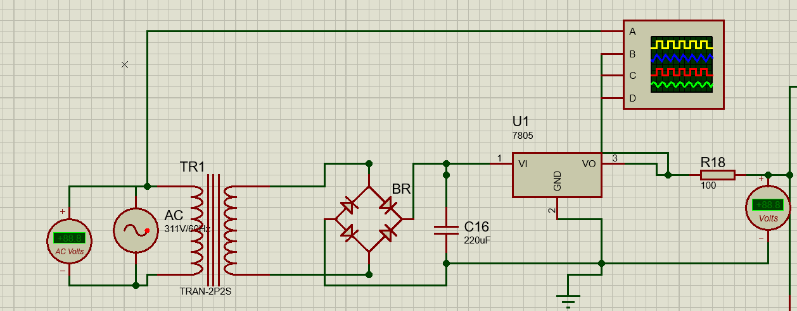
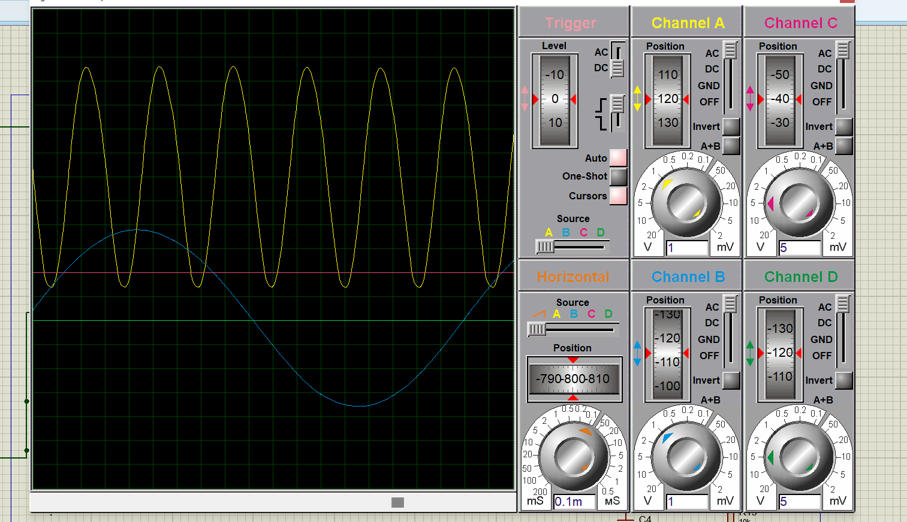
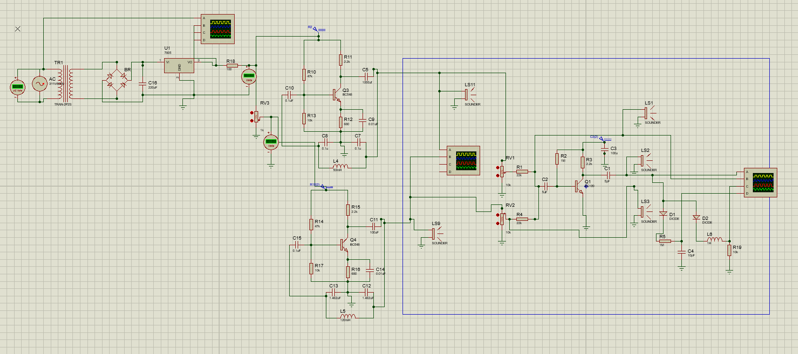
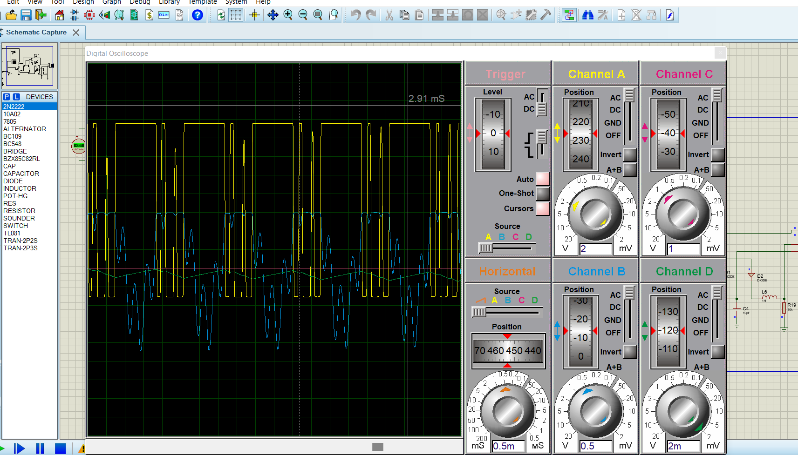

# Electronic-signal-mixing-and-filtering
This project is a schematic design of and electronic circuit to generate two audio signals one in upper mid range frequency and the other is one sixth of the frequency of the first signal. The circuit then mixed the two signals and filters them back using high pass and low pass filtering circuits. 

**The project is done using only descrete components**

## Parts of The Design

### Power supply

The power supply converts a 220V/50Hz AC input signal to A 15 DC using the following circuit

### Sound wave generator

After converting the AC to DC we will need to generate two different Audio signals one in upper mid range frequency and the other with a frequency of one sixth(1/6) of the frequency of the first. The Audio signals are generated in sine wave form using Colpitt's Crystal oscillator. Since all parts of the project is descrete components based the circuit may look a little different from the normal Colpitt's crystal oscillator but the internal structure is the same.  The Signal generator circuit is shown below. 

And the generated signals are : 

### Signal mixer 
The two signals are then mixed using a regular mixer which is a network of resitors and inductors.using the following circuit

### Filters 
After the mixing of the two signals we may need to filter out the two signals separately for different purposes for example to retrieve the message from the signals, to process the signals separetly, to sample the signals based on their frequencies. In order to retrieve the signals from the mixed signals I have used one high pass filter(using a resistor and capacitor) and one low pass filter(using inductor and resistor) the values of the resistor, capacitor and the inductor are calculated base on the required frequency. 

## The final working wave forms

fig: Working waveforms of the mixed signal and the filtered signals

Tewodros Seble
© All Right Reserved

